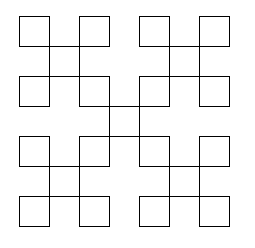
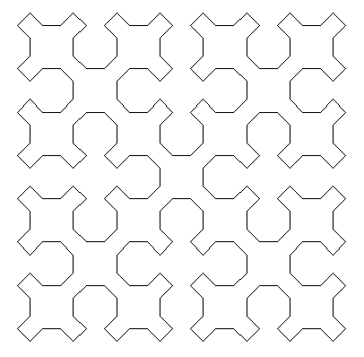

# fractals

## Mandelbrot set generator
This Python script uses the NumPy and Matplotlib libraries to draw the Mandlebrot set. The resulting image has a final name corresponding to the values used to generate it (the x and y offsets, as well as the magnification)  

  

### Key features:
* Provides options to create images with different magnifications and offsets in the x and y directions.
* Although drawn as a square image with a fixed aspect ratio, the resolution of the image can be modified with the 'step' variable in the program, measured in pixels. 
* You can use the grayscale flag to choose between a colour or black and white image.

## Sierpinski curve generator
There are two separate Python scripts:
* `straight_sierpinski.py` allows the lines that form the Sierpinski curve to overlap.  
  

  
* `curved_sierpinski.py` draws extended corners on each of the 'squares' of the pattern, allowing individual parts to be distinguished.  
  

